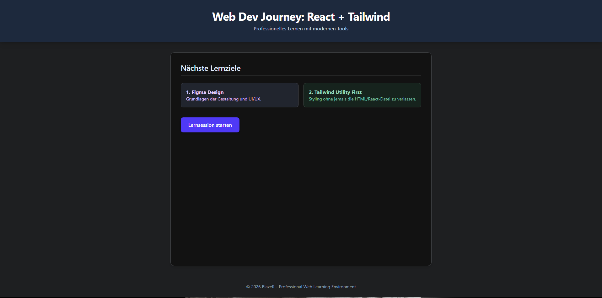

# <p align="center">🚀 Web Dev Learning Journey</p>

<div align="center">

[](https://react.dev/)
[](https://vitejs.dev/)
[](https://tailwindcss.com/)
[](./LICENSE)

**Ein professionelles Lern-Ökosystem für moderne Webentwicklung.**

[Voraussetzungen](#-voraussetzungen) • [Installation](#-installation) • [Projektstruktur](#-projektstruktur) • [Roadmap](#-roadmap)

---

</div>

## 📸 Preview
<div align="center">
  
  <p><em>Aktueller Stand: React + Tailwind v4 Dashboard</em></p>
</div>

## ✨ Key Features
- ⚡ **Next-Gen Tooling:** Nutzt Vite 8 für blitzschnelle Entwicklung.
- 🎨 **Utility-First Styling:** Komplett mit Tailwind CSS v4 gestaltet.
- 🧩 **Component Architecture:** Modularer Aufbau mit React 19.
- 📐 **Design-First Workflow:** Enge Kopplung an Figma-Prototypen.

## 🛠 Tech Stack
| Tool | Funktion | Status |
| :--- | :--- | :--- |
| **React 19** | UI Library | 🟢 Aktiv |
| **Vite 8** | Build Tool | 🟢 Aktiv |
| **Tailwind v4** | CSS Framework | 🟢 Aktiv |
| **Figma** | UI/UX Design | 🟡 Geplant |
| **Git/GitHub** | Versionierung | 🟢 Aktiv |

## 📂 Projektstruktur
```bash
.
├── archive/           # Frühere Meilensteine (HTML/CSS)
├── public/            # Statische Assets (Icons, Fonts)
├── src/
│   ├── assets/        # Bilder & Grafiken
│   ├── components/    # (Bald verfügbar) Wiederverwendbare UI-Elemente
│   ├── styles/        # Globales CSS (Tailwind)
│   ├── App.jsx        # Hauptanwendung
│   └── main.jsx       # Einstiegspunkt
└── README.md
```

## 🚀 Installation & Start
### Voraussetzungen
- [Node.js](https://nodejs.org/) (v20 oder höher)
- [npm](https://www.npmjs.com/)

### Schritte
1. **Repository clonen**
   ```bash
   git clone https://github.com/BlazeR-28/web-dev-learning.git
   ```
2. **Abhängigkeiten installieren**
   ```bash
   npm install
   ```
3. **Entwicklungsserver starten**
   ```bash
   npm run dev
   ```

## 🗺 Roadmap
- [x] Initiales Setup mit React + Vite
- [x] Tailwind CSS v4 Integration
- [ ] Erstes Figma Design erstellen
- [ ] Umsetzung der ersten React-Komponenten
- [ ] Deployment (Vercel oder Netlify)

## 📄 Lizenz
Dieses Projekt ist unter der MIT-Lizenz lizenziert. Weitere Informationen findest du in der [LICENSE](./LICENSE)-Datei.

---
<p align="center">
  Entwickelt mit ❤️ von <strong>BlazeR</strong><br />
  <em>"Learning by doing is the professional way."</em>
</p>
